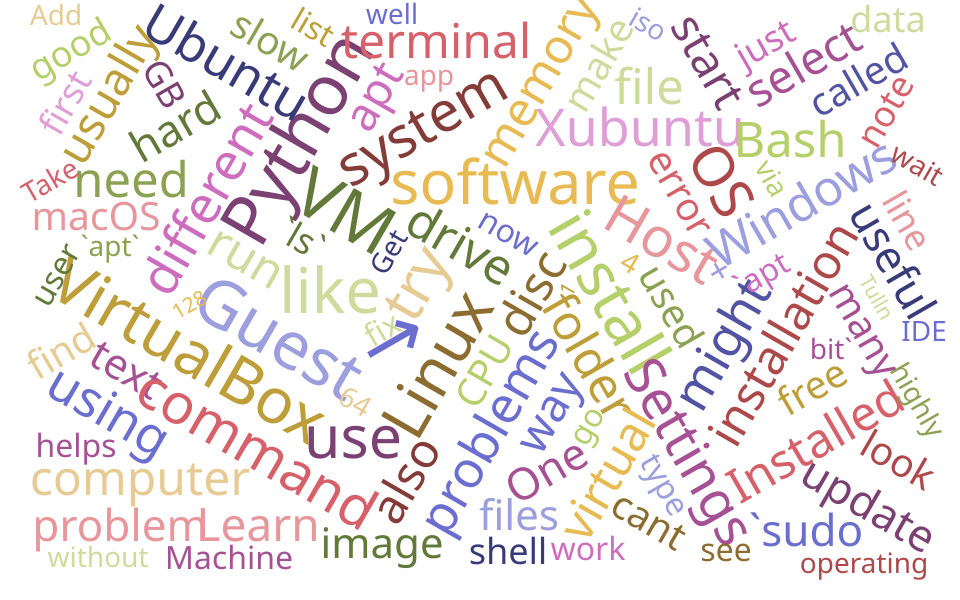

FHWN, Biotech Campus Tulln

Hi there! This is a small collection of useful links and information that will help you get started with Bio Data Science.

- [General information](general_info.md)
- [Summer school info](summer_school.md)

Setting up your Linux environment — pick the one that matches your computer:

- [Install Ubuntu in WSL](install_linux_in_wsl.md) — **recommended for Windows**
- [Install Ubuntu on Apple silicon](install_linux_on_apple_silicon.md) — for Macs with M-series chips
- [Install Ubuntu in VirtualBox](install_linux_in_virtualbox.md) — alternative for Windows, if you want a Linux desktop or WSL is unavailable

Then, on every platform:

- [Ubuntu basics](ubuntu_basics.md) — the shell, the file system, package management
- [Install Miniforge (conda)](install_conda.md) — the package and environment manager used throughout the curriculum

 

